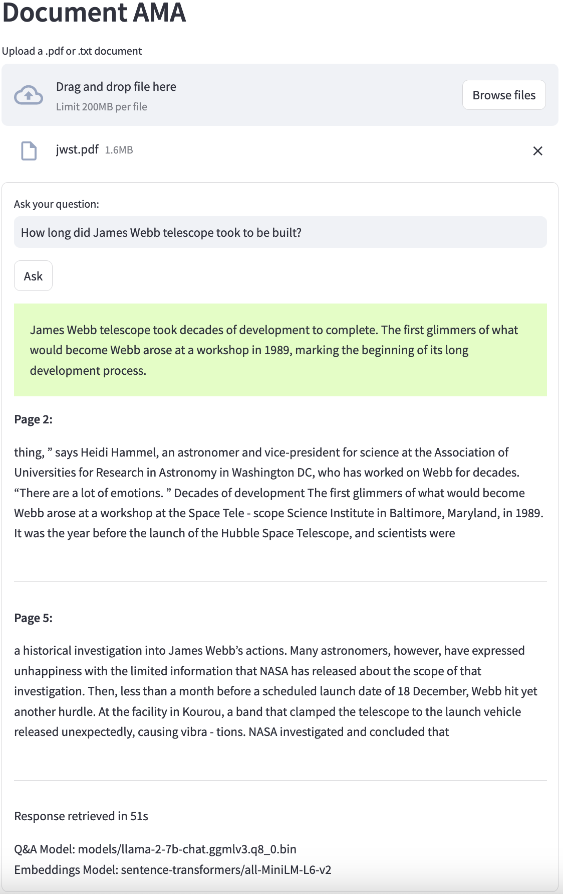

# Document AMA

Building upon [kennethleungty/Llama-2-Open-Source-LLM-CPU-Inference](https://github.com/kennethleungty/Llama-2-Open-Source-LLM-CPU-Inference)
with a [Streamlit](https://streamlit.io/) front-end. It allows to load any `.txt` file or `.pdf`
document with text and asking any questions about it using LLMs on CPU.



## Setting up

### Docker

Build the docker image:
```shell
docker build -t document-ama .
```

Run it:
```shell
docker run -d -p 8501:8501 --name document-ama document-ama:latest
```

Open the Streamlit app in your browser:
```shell
http://localhost:8501/
```

### Local env

Init a VENV, if desired:
```shell
python3 -m venv venv
source venv/bin/activate
```

Install requirements:
```sh
pip install -r requirements.txt
```

Run streamlit:
```shell
streamlit run app.py
```

A new browser window will pop up with the streamlit app.

## Architecture and `app.py` code flow

(Also see the [medium article](https://towardsdatascience.com/running-llama-2-on-cpu-inference-for-document-q-a-3d636037a3d8)
for the original code architecture)

It is currently set up to run with the [8-bit quantized version of Llama2 that runs on GGML](https://huggingface.co/TheBloke/Llama-2-7B-Chat-GGML/blob/main/llama-2-7b-chat.ggmlv3.q8_0.bin)
and [sentence-transformers/all-MiniLM-L6-v2](https://huggingface.co/sentence-transformers/all-MiniLM-L6-v2)
as the embeddings model. If those models are not present (e.g. in the first run), it will first download them.

Then, it will ask for a file to be uploaded. It needs to be either a `.txt` file or a `.pdf` file with selectable
text in them. **It will not try to OCR the document.**

Once the document is uploaded, [Langchain](https://python.langchain.com) is being used to:
1. Load those documents into it;
1. Extract the text with [PyPDF](https://github.com/py-pdf/pypdf);
1. Split it into 500-character chunks (with 50-character overlap);
1. Calculate the embeddings vector of each chunk;
1. and finally load those embeddings with their respective chunks into a
[FAISS](https://github.com/facebookresearch/faiss) database.

The FAISS files are being saved on disk under a folder with the checksum of each file, so if the exact
same file is uploaded again it will just reuse the previously created database instead of re-doing them.

After that is done, it asks for the question. It will then load the LLM model into memory
using [CTransformers](https://github.com/marella/ctransformers) and keep using Langchain to:
1. Load the FAISS db to memory;
1. Build a prompt template with the question and the hardcoded prompt template string;
1. Build a RetrievalQA database with the LLM to load the context relative to the question into the prompt template;
1. Ask the RetrievalQA database the question

After the RetrievalQA returns with an answer, it will display the answer and the relevant passages of the
text to that answer.
